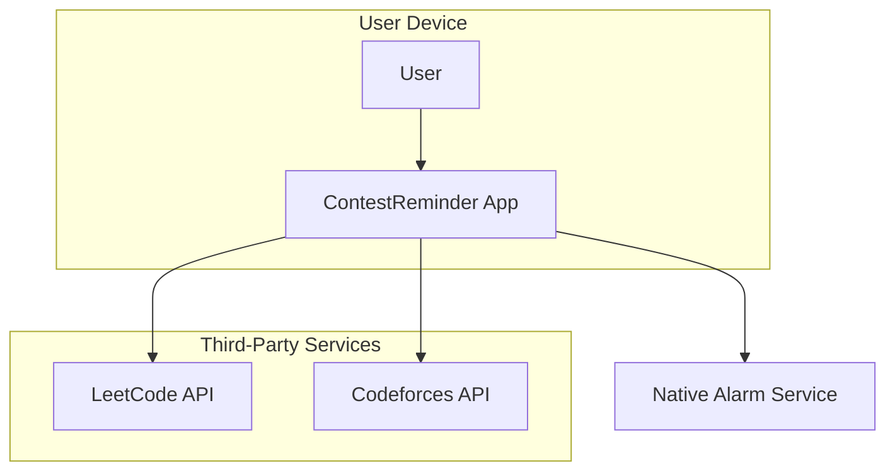
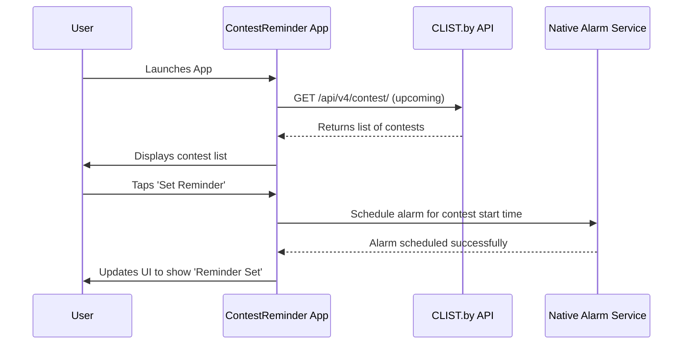
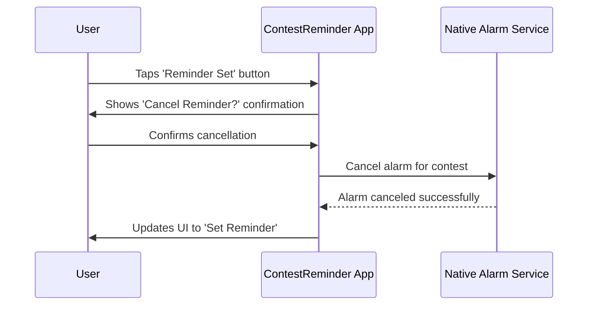
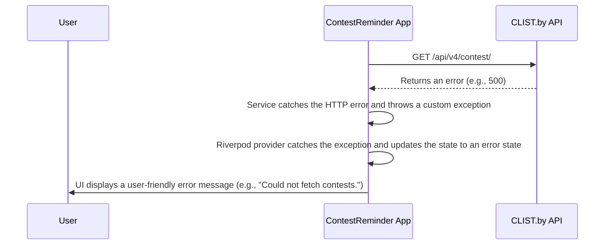

# ContestReminder Fullstack Architecture Document

## 1. Introduction

This document outlines the complete fullstack architecture for ContestReminder, including backend systems, frontend implementation, and their integration. It serves as the single source of truth for AI-driven development, ensuring consistency across the entire technology stack.

This unified approach combines what would traditionally be separate backend and frontend architecture documents, streamlining the development process for modern fullstack applications where these concerns are increasingly intertwined.

### 1.1. Starter Template or Existing Project

Based on the PRD, this is a greenfield project. The PRD recommends a cross-platform framework (Flutter or React Native) and the `front-end-spec.md` specifies the use of the Material 3 design system.

Given the client-side only architecture (NFR5) and the need for reliable native alarm integration (a high-risk feature), I recommend starting with a minimal, clean project template provided by the chosen framework (e.g., `flutter create` or `npx react-native init`). This avoids unnecessary dependencies and constraints from more opinionated starter kits, allowing us to focus on the core, high-risk features first.

### 1.2. Change Log

| Date | Version | Description | Author |
| :--- | :--- | :--- | :--- |
| 2025-09-02 | 1.0 | Initial architecture draft | Winston (Architect) |

---

## 2. High Level Architecture

### 2.1. Technical Summary

The architecture for ContestReminder is a **client-side only, single-screen mobile application** for iOS and Android. It will be built with a cross-platform framework (either Flutter or React Native) and will follow Material 3 design guidelines. For the MVP, there will be no backend; the application will fetch data directly from third-party contest APIs (like LeetCode and Codeforces). The most critical integration point is with the **native system alarm services** on both iOS and Android to ensure 100% reliability for reminders. This minimalist approach directly supports the PRD goals by focusing all effort on the core user value and enabling rapid delivery to the app stores.

### 2.2. Platform and Infrastructure Choice

**Platform:** Mobile (iOS & Android)
**Key Services:** Native System Alarm APIs (iOS & Android)
**Deployment Host and Regions:** Not applicable for the MVP, as this is a client-side only application. Deployment will be through the Apple App Store and Google Play Store.

### 2.3. Repository Structure

**Structure:** Monorepo
**Monorepo Tool:** Not applicable for the MVP, as we will start with a single project in the repository. A monorepo structure is recommended to easily accommodate a backend or shared libraries in the future without needing to restructure.
**Package Organization:** A standard cross-platform project structure will be used.

### 2.4. High Level Architecture Diagram



### 2.5. Architectural Patterns

-   **Client-Side Only Architecture:** The application logic resides entirely on the user's device. This simplifies development and reduces infrastructure costs for the MVP. *Rationale:* This is the fastest and most direct way to deliver the core functionality defined in the PRD.
-   **Component-Based UI:** The user interface will be constructed from reusable components. *Rationale:* This is a standard, effective practice for modern UI development that promotes maintainability and consistency.
-   **Third-Party API Integration:** The application will consume data directly from external APIs. *Rationale:* This avoids the need for a backend, which is a key constraint of the MVP (NFR5).

---
## 3. Tech Stack

### 3.1. Technology Stack Table

| Category | Technology | Version | Purpose | Rationale |
| :--- | :--- | :--- | :--- | :--- |
| **Frontend Language** | Dart | latest | Core language for Flutter | Required by the Flutter framework. |
| **Frontend Framework** | **Flutter** | **latest** | **Cross-platform UI toolkit** | **Recommended for its strong native integration capabilities, which are critical for the reliable alarm feature.** |
| **UI Component Library** | Material 3 | latest | UI components and styling | Specified in the `front-end-spec.md` for a modern, clean aesthetic. |
| **State Management** | Riverpod | latest | State management | A simple and powerful state management solution for Flutter that is compile-safe. |
| **API Style** | REST | N/A | Consuming third-party APIs | The contest platforms expose REST APIs. |
| **Frontend Testing** | flutter_test | SDK | Unit and widget testing | The standard testing framework for Flutter. |
| **E2E Testing** | integration_test | SDK | End-to-end testing | The official Flutter package for E2E testing. |
| **CI/CD** | GitHub Actions | latest | Continuous integration/delivery | A flexible and powerful CI/CD platform that is well-integrated with GitHub. |
| **Monitoring** | Firebase Crashlytics | latest | Crash reporting | A robust and easy-to-integrate crash reporting tool. |

---
## 4. Data Models

Based on the PRD, we need a core `Contest` model to represent the data fetched from third-party APIs. This model will be used throughout the application to display contest information.

### 4.1. Contest

**Purpose:** To represent a single coding contest.

**Key Attributes:**
-   `name`: String - The name of the contest.
-   `platform`: String - The platform hosting the contest (e.g., "LeetCode").
-   `startTime`: DateTime - The start date and time of the contest.
-   `url`: String - The URL to the contest page.
-   `duration`: String - The duration of the contest.
-   `isReminderSet`: bool - A client-side flag to track if a reminder has been set for this contest.

#### 4.1.1. Dart Class

```dart
class Contest {
  final String name;
  final String platform;
  final DateTime startTime;
  final String url;
  final String duration;
  bool isReminderSet;

  Contest({
    required this.name,
    required this.platform,
    required this.startTime,
    required this.url,
    required this.duration,
    this.isReminderSet = false,
  });
}
```

#### 4.1.2. Relationships

This model is self-contained and has no relationships with other data models in the MVP.

---
## 5. External APIs

### 5.1. CLIST.by API (Corrected)

-   **Purpose:** To fetch a list of upcoming coding contests from multiple platforms.
-   **Documentation:** [https://clist.by/api/v4/doc/](https://clist.by/api/v4/doc/)
-   **Base URL(s):** `https://clist.by/api/v4/`
-   **Authentication:** API Key. This key must be included in all requests.
-   **Rate Limits:** 10 requests per minute.

**Key Endpoints Used:**
-   `GET /api/v4/contest/` - This endpoint will be used to fetch a list of all contests. We will filter the results to show only upcoming contests.
-   `GET /api/v4/contest/{id}/` - Can be used to fetch details for a specific contest by its ID.

**Integration Notes:**
-   A `clist.by` API key is required and will need to be stored securely within the mobile application.
-   The rate limit is sufficient for our needs, but we should implement caching on the device to improve performance and avoid unnecessary API calls.
-   This single API will be the source for all contest data in the MVP.

---
## 6. Core Workflows

### 6.1. Set Contest Reminder (Corrected)

This diagram shows the sequence of events when a user sets a reminder for a contest.



### 6.2. Cancel Contest Reminder

This diagram shows the sequence for canceling a previously set reminder.



---
## 7. Frontend Architecture

### 7.1. Component Architecture

#### 7.1.1. Component Organization

We will follow a feature-based folder structure. For our simple, single-screen MVP, this will be very straightforward:

```
lib/
├── main.dart                 # App entry point
└── features/
    └── contest_list/
        ├── data/
        │   ├── contest_repository.dart
        │   └── contest_service.dart
        ├── presentation/
        │   ├── providers/
        │   │   └── contest_providers.dart
        │   ├── widgets/
        │   │   └── contest_card.dart
        │   └── contest_list_screen.dart
        └── models/
            └── contest.dart
```

#### 7.1.2. Component Template

All UI components will be `StatelessWidget` or `ConsumerWidget` (from Riverpod) to ensure a reactive and predictable UI.

```dart
import 'package:flutter/material.dart';

class ContestCard extends StatelessWidget {
  const ContestCard({super.key});

  @override
  Widget build(BuildContext context) {
    return Card(
      child: Padding(
        padding: const EdgeInsets.all(16.0),
        child: Column(
          crossAxisAlignment: CrossAxisAlignment.start,
          children: [
            // Contest details will go here
          ],
        ),
      ),
    );
  }
}
```

### 7.2. State Management Architecture

We will use **Riverpod** for state management.

#### 7.2.1. State Structure

The state will be managed by a `Notifier` that holds the list of contests.

```dart
import 'package:riverpod_annotation/riverpod_annotation.dart';
// ... other imports

@riverpod
class ContestList extends _$ContestList {
  @override
  Future<List<Contest>> build() async {
    // Initially, fetch the contests.
    // This will be handled by the repository.
    return _fetchContests();
  }

  Future<List<Contest>> _fetchContests() async {
    // ... logic to call the repository
  }

  void setReminder(String contestId) {
    // ... logic to update the reminder status for a contest
  }
}
```

#### 7.2.2. State Management Patterns

-   **NotifierProvider:** To provide and manage the state of the contest list.
-   **FutureProvider:** To handle the initial asynchronous fetching of contest data from the API.
-   **ConsumerWidget:** To rebuild UI components when the state changes.

### 7.3. Routing Architecture

#### 7.3.1. Route Organization

As this is a single-screen application, the routing will be minimal. The `main.dart` file will set up the `MaterialApp` and define the home screen.

```dart
import 'package:flutter/material.dart';
import 'package:contest_reminder/features/contest_list/presentation/contest_list_screen.dart';

void main() {
  runApp(const MyApp());
}

class MyApp extends StatelessWidget {
  const MyApp({super.key});

  @override
  Widget build(BuildContext context) {
    return MaterialApp(
      title: 'Contest Reminder',
      theme: ThemeData(
        primarySwatch: Colors.blue,
        useMaterial3: true,
      ),
      home: const ContestListScreen(),
    );
  }
}
```

#### 7.3.2. Protected Route Pattern

Not applicable for the MVP, as there is no authentication.

### 7.4. Frontend Services Layer

#### 7.4.1. API Client Setup

We will use the standard `http` package for making API calls to `clist.by`.

#### 7.4.2. Service Example

A service class will encapsulate the logic for fetching data from the API.

```dart
import 'package:http/http.dart' as http;
import 'dart:convert';

class ContestService {
  final String _baseUrl = "https://clist.by/api/v4";
  final String _apiKey = "YOUR_API_KEY"; // This will be stored securely

  Future<List<dynamic>> getUpcomingContests() async {
    final response = await http.get(
      Uri.parse('$_baseUrl/contest/?upcoming=true&format=json&username=YOUR_USERNAME&api_key=$_apiKey')
    );

    if (response.statusCode == 200) {
      return json.decode(response.body)['objects'];
    } else {
      throw Exception('Failed to load contests');
    }
  }
}
```

---
## 8. Unified Project Structure

```
ContestReminder/
├── .github/                    # CI/CD workflows
│   └── workflows/
│       └── ci.yaml
├── lib/                        # Main Flutter application code
│   ├── main.dart
│   └── features/
│       └── contest_list/
│           ├── data/
│           ├── presentation/
│           └── models/
├── test/                       # Automated tests
├── assets/                     # Static assets like images or fonts
├── docs/                       # Project documentation (PRD, Architecture, etc.)
│   ├── prd.md
│   └── architecture.md
├── .gitignore
├── pubspec.yaml                # Flutter project dependencies
└── README.md
```

**Rationale:** This structure is clean, standard for a Flutter project, and provides clear separation for application code (`lib`), tests (`test`), assets, and documentation (`docs`). It gives us a solid foundation for the MVP while being flexible enough to grow.

---
## 9. Development Workflow

### 9.1. Local Development Setup

#### 9.1.1. Prerequisites

-   **Flutter SDK:** Install the latest stable version of the Flutter SDK.
-   **IDE:** Android Studio or Visual Studio Code with the official Flutter extension.
-   **iOS/Android Simulators:** Set up an iOS Simulator (on macOS) or an Android Emulator.

#### 9.1.2. Initial Setup

```bash
# Clone the repository
git clone <repository_url>
cd ContestReminder

# Install dependencies
flutter pub get
```

#### 9.1.3. Development Commands

```bash
# Run the app in debug mode
flutter run

# Run all tests
flutter test

# Build the release version of the app
flutter build apk
flutter build ipa
```

### 9.2. Environment Configuration

#### 9.2.1. Required Environment Variables

We will use the `flutter_dotenv` package to manage environment variables. Create a `.env` file in the root of the project with the following content:

```
# .env

# Your API key from clist.by
CLIST_API_KEY="your_api_key_here"
CLIST_USERNAME="your_username_here"
```

This file should be added to `.gitignore` and should never be committed to version control.

---
## 10. Deployment Architecture

### 10.1. Deployment Strategy

Since this is a mobile application, deployment means publishing to the app stores.

**Application Deployment:**
-   **Platform:** Apple App Store and Google Play Store.
-   **Build Command:** `flutter build ipa` for iOS and `flutter build appbundle` for Android.
-   **Output Directory:** `build/ios/` for iOS and `build/app/` for Android.

### 10.2. CI/CD Pipeline

We will use GitHub Actions for our CI/CD pipeline. The following workflow will run on every push to the `main` branch to ensure the app builds correctly and all tests pass.

```yaml
# .github/workflows/ci.yaml

name: Build and Test

on:
  push:
    branches: [ main ]
  pull_request:
    branches: [ main ]

jobs:
  build:
    runs-on: ubuntu-latest

    steps:
    - uses: actions/checkout@v3
    - uses: subosito/flutter-action@v2
      with:
        channel: 'stable'

    - name: Install dependencies
      run: flutter pub get

    - name: Run tests
      run: flutter test

    - name: Build Android App Bundle
      run: flutter build appbundle

    # Note: Building for iOS requires a macOS runner
    # This is a simplified example.
    # - name: Build iOS App
    #   run: flutter build ipa
```

### 10.3. Environments

| Environment | Platform | Purpose |
| :--- | :--- | :--- |
| **Development** | Local Simulator/Device | Day-to-day development and debugging. |
| **Staging** | TestFlight (iOS) & Google Play Internal Testing (Android) | Internal testing and QA before a production release. |
| **Production** | Apple App Store & Google Play Store | The live application available to all users. |

---
## 11. Security and Performance

### 11.1. Security Requirements

**Application Security:**
-   **API Key Storage:** The `CLIST_API_KEY` is the most sensitive piece of information in the application. To protect it, we will use the `flutter_secure_storage` package, which utilizes hardware-backed secure storage mechanisms on both iOS (Keychain) and Android (Keystore). This is significantly more secure than storing it in source code or a bundled environment file.
-   **Network Security:** All communication with the `clist.by` API will be over HTTPS.

**Backend Security:**
-   Not applicable for the MVP.

**Authentication Security:**
-   Not applicable for the MVP.

### 11.2. Performance Optimization

**Application Performance:**
-   **Bundle Size Target:** We will aim to keep the initial download size of the application under 20MB to ensure a quick and easy installation for users.
-   **Loading Strategy:** While fetching the initial contest list, the UI will display a skeleton loading screen (e.g., with a shimmer effect). This provides immediate visual feedback and improves the perceived performance of the app.
-   **Caching Strategy:** The fetched contest list will be cached in memory to avoid re-fetching on every app launch. We will implement a short-term caching mechanism (e.g., 5-10 minutes) to ensure the data is reasonably fresh without making excessive API calls.

---
## 12. Testing Strategy

We will follow the testing pyramid principle, focusing on a large base of fast and isolated unit tests, a good number of widget tests for our UI components, and a smaller set of comprehensive end-to-end tests.

### 12.1. Testing Pyramid

```
      /\
     /  \  <-- E2E (Integration) Tests
    /____\
   /      \ <-- Widget Tests
  /________\ 
 /          \<- Unit Tests
/____________\
```

### 12.2. Test Organization

All tests will be located in the `test/` directory, following standard Flutter conventions.

-   **Unit Tests:** These will be used to test individual functions, methods, and classes in isolation. This is where we will test our data models and the logic of our API service (by mocking the HTTP client).
-   **Widget Tests:** These will be used to test our UI components (widgets). We will verify that our widgets render correctly and respond to user interaction as expected.
-   **E2E (Integration) Tests:** These tests will run on a real device or simulator to automate and verify complete user flows, such as fetching the contest list, setting a reminder, and canceling it. We will use the `integration_test` package for this.

### 12.3. Test Examples

#### 12.3.1. Unit Test Example (Service)

```dart
// test/features/contest_list/data/contest_service_test.dart
import 'package:flutter_test/flutter_test.dart';
import 'package:http/http.dart' as http;
import 'package:mockito/mockito.dart';
// ... other imports

// Create a MockClient using the Mockito package
class MockClient extends Mock implements http.Client {}

void main() {
  test('returns a list of contests if the http call completes successfully', () async {
    final client = MockClient();
    final service = ContestService(client); // Assuming ContestService takes a client

    // Use Mockito to return a successful response when the http client is called.
    when(client.get(any)).thenAnswer((_) async => http.Response('{"objects": []}', 200));

    expect(await service.getUpcomingContests(), isA<List>());
  });
}
```

#### 12.3.2. Widget Test Example (UI Component)

```dart
// test/features/contest_list/presentation/widgets/contest_card_test.dart
import 'package:flutter/material.dart';
import 'package:flutter_test/flutter_test.dart';
import 'package:contest_reminder/features/contest_list/presentation/widgets/contest_card.dart';
import 'package:contest_reminder/features/contest_list/models/contest.dart'; // Assuming Contest model is here
// ... other imports

void main() {
  testWidgets('ContestCard displays contest name and platform', (WidgetTester tester) async {
    // Build our app and trigger a frame.
    await tester.pumpWidget(MaterialApp(
      home: Scaffold(
        body: ContestCard(
          contest: Contest(name: 'Weekly Contest 395', platform: 'LeetCode', startTime: DateTime.now(), url: '', duration: ''), // Provide necessary args
        ),
      ),
    ));

    // Verify that the contest name and platform are displayed.
    expect(find.text('Weekly Contest 395'), findsOneWidget);
    expect(find.text('LeetCode'), findsOneWidget);
  });
}
```

#### 12.3.3. E2E Test Example

```dart
// test_driver/app_test.dart
import 'package:flutter_test/flutter_test.dart';
import 'package:integration_test/integration_test.dart';
import 'package:contest_reminder/main.dart' as app;

void main() {
  IntegrationTestWidgetsFlutterBinding.ensureInitialized();

  testWidgets('tap on the reminder button changes its state', (tester) async {
    app.main();
    await tester.pumpAndSettle();

    // Find the first reminder button. Assuming it's an IconButton with an alarm_add icon.
    final reminderButtonFinder = find.byIcon(Icons.alarm_add).first;

    // Verify the button is present before tapping
    expect(reminderButtonFinder, findsOneWidget);

    // Tap the button.
    await tester.tap(reminderButtonFinder);
    await tester.pumpAndSettle();

    // Verify the button's icon has changed to indicate the reminder is set.
    // Assuming the icon changes to Icons.alarm_on after tapping.
    expect(find.byIcon(Icons.alarm_on), findsOneWidget);
  });
}
```

---
## 13. Coding Standards

### 13.1. Critical Fullstack Rules

-   **State Management:** State should be managed exclusively through Riverpod providers. Avoid using `StatefulWidget` for managing business or screen-level state.
-   **API Calls:** All network requests must be handled within the `data` layer (i.e., the `ContestRepository` and `ContestService`). UI components should never make direct API calls.
-   **Environment Variables:** Access secrets like the API key only through a dedicated configuration service that reads from secure storage. Never access them directly in the UI.
-   **Error Handling:** All asynchronous operations, especially API calls, must include robust error handling and provide clear feedback to the user.
-   **Immutability:** Treat state as immutable. When updating state, create a new object rather than modifying the existing one.

### 13.2. Naming Conventions

| Element | Convention | Example |
| :--- | :--- | :--- |
| Files | `snake_case.dart` | `contest_list_screen.dart` |
| Classes | `PascalCase` | `ContestCard` |
| Methods/Functions | `camelCase()` | `fetchContests()` |
| Variables | `camelCase` | `contestName` |
| Constants | `kCamelCase` | `kDefaultPadding` |

---
## 14. Error Handling Strategy

### 14.1. Error Flow

This diagram illustrates how the application will handle an error when fetching data from the `clist.by` API.



### 14.2. Error Response Format

Since we are consuming an external API, we don't control the error response format. Internally, our application will wrap different kinds of errors into a unified format.

```dart
// A simple class to represent different failure types.
abstract class Failure {
  final String message;
  const Failure(this.message);
}

class ServerFailure extends Failure {
  const ServerFailure(String message) : super(message);
}

class NetworkFailure extends Failure {
  const NetworkFailure(String message) : super(message);
}
```

### 14.3. Frontend Error Handling

We will leverage Riverpod's built-in error handling capabilities. The `FutureProvider` or `Notifier` will automatically expose `AsyncValue` which can be in a loading, data, or error state. The UI will react to these states accordingly.

```dart
// provider
@riverpod
Future<List<Contest>> contestList(ContestListRef ref) async {
  final repository = ref.watch(contestRepositoryProvider);
  return repository.getUpcomingContests();
}

// widget
class ContestListScreen extends ConsumerWidget {
  const ContestListScreen({super.key});

  @override
  Widget build(BuildContext context, WidgetRef ref) {
    final contestsAsync = ref.watch(contestListProvider);

    return contestsAsync.when(
      loading: () => const Center(child: CircularProgressIndicator()),
      error: (err, stack) => Center(child: Text('Error: $err')),
      data: (contests) {
        return ListView.builder(
          itemCount: contests.length,
          itemBuilder: (context, index) {
            return ContestCard(contest: contests[index]);
          },
        );
      },
    );
  }
}
```

### 14.4. Backend Error Handling

Not applicable for the MVP.

---
## 15. Monitoring and Observability

### 15.1. Monitoring Stack

We will use the **Firebase** suite for monitoring, as it is well-integrated with Flutter and provides a comprehensive set of tools.

-   **Error Tracking:** **Firebase Crashlytics** will be used to automatically report crashes and non-fatal errors.
-   **Performance Monitoring:** **Firebase Performance Monitoring** will be used to measure app launch times and the performance of our API calls.
-   **Analytics:** **Firebase Analytics** will be used to gather anonymized data on user engagement, such as how many reminders are set.

### 15.2. Key Metrics

We will track the following key metrics to measure the health and success of the application:

**Stability Metrics:**
-   Crash-free users rate
-   API error rate

**Performance Metrics:**
-   App launch time
-   API response time from `clist.by`

**User Engagement Metrics:**
-   Daily/Monthly Active Users (DAU/MAU)
-   Number of reminders set per session
-   Number of reminders canceled
