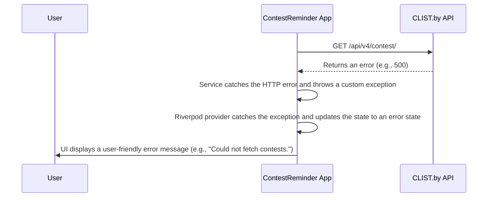

# 14. Error Handling Strategy

## 14.1. Error Flow

This diagram illustrates how the application will handle an error when fetching data from the `clist.by` API.



## 14.2. Error Response Format

Since we are consuming an external API, we don't control the error response format. Internally, our application will wrap different kinds of errors into a unified format.

```dart
// A simple class to represent different failure types.
abstract class Failure {
  final String message;
  const Failure(this.message);
}

class ServerFailure extends Failure {
  const ServerFailure(String message) : super(message);
}

class NetworkFailure extends Failure {
  const NetworkFailure(String message) : super(message);
}
```

## 14.3. Frontend Error Handling

We will leverage Riverpod's built-in error handling capabilities. The `FutureProvider` or `Notifier` will automatically expose `AsyncValue` which can be in a loading, data, or error state. The UI will react to these states accordingly.

```dart
// provider
@riverpod
Future<List<Contest>> contestList(ContestListRef ref) async {
  final repository = ref.watch(contestRepositoryProvider);
  return repository.getUpcomingContests();
}

// widget
class ContestListScreen extends ConsumerWidget {
  const ContestListScreen({super.key});

  @override
  Widget build(BuildContext context, WidgetRef ref) {
    final contestsAsync = ref.watch(contestListProvider);

    return contestsAsync.when(
      loading: () => const Center(child: CircularProgressIndicator()),
      error: (err, stack) => Center(child: Text('Error: $err')),
      data: (contests) {
        return ListView.builder(
          itemCount: contests.length,
          itemBuilder: (context, index) {
            return ContestCard(contest: contests[index]);
          },
        );
      },
    );
  }
}
```

## 14.4. Backend Error Handling

Not applicable for the MVP.

---