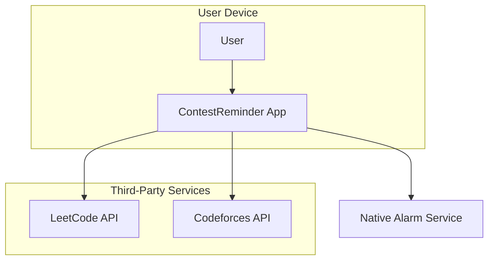

# 2. High Level Architecture

## 2.1. Technical Summary

The architecture for ContestReminder is a **client-side only, single-screen mobile application** for iOS and Android. It will be built with a cross-platform framework (either Flutter or React Native) and will follow Material 3 design guidelines. For the MVP, there will be no backend; the application will fetch data directly from third-party contest APIs (like LeetCode and Codeforces). The most critical integration point is with the **native system alarm services** on both iOS and Android to ensure 100% reliability for reminders. This minimalist approach directly supports the PRD goals by focusing all effort on the core user value and enabling rapid delivery to the app stores.

## 2.2. Platform and Infrastructure Choice

**Platform:** Mobile (iOS & Android)
**Key Services:** Native System Alarm APIs (iOS & Android)
**Deployment Host and Regions:** Not applicable for the MVP, as this is a client-side only application. Deployment will be through the Apple App Store and Google Play Store.

## 2.3. Repository Structure

**Structure:** Monorepo
**Monorepo Tool:** Not applicable for the MVP, as we will start with a single project in the repository. A monorepo structure is recommended to easily accommodate a backend or shared libraries in the future without needing to restructure.
**Package Organization:** A standard cross-platform project structure will be used.

## 2.4. High Level Architecture Diagram

## 2.5. Architectural Patterns

-   **Client-Side Only Architecture:** The application logic resides entirely on the user's device. This simplifies development and reduces infrastructure costs for the MVP. *Rationale:* This is the fastest and most direct way to deliver the core functionality defined in the PRD.
-   **Component-Based UI:** The user interface will be constructed from reusable components. *Rationale:* This is a standard, effective practice for modern UI development that promotes maintainability and consistency.
-   **Third-Party API Integration:** The application will consume data directly from external APIs. *Rationale:* This avoids the need for a backend, which is a key constraint of the MVP (NFR5).

---