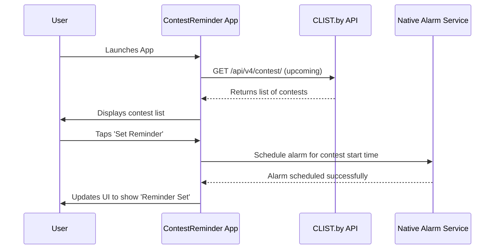
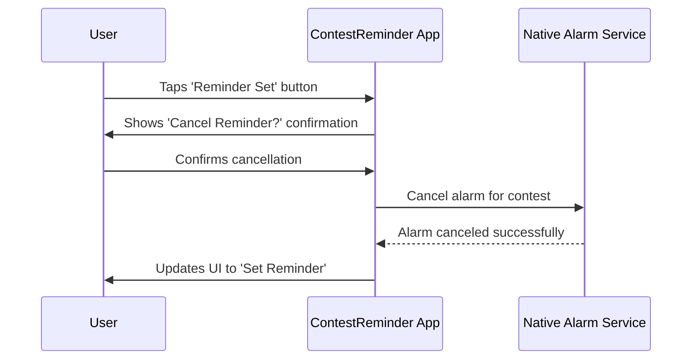

# 6. Core Workflows

## 6.1. Set Contest Reminder (Corrected)

This diagram shows the sequence of events when a user sets a reminder for a contest.

## 6.2. Cancel Contest Reminder

This diagram shows the sequence for canceling a previously set reminder.

---