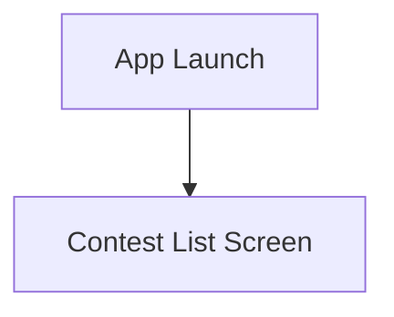
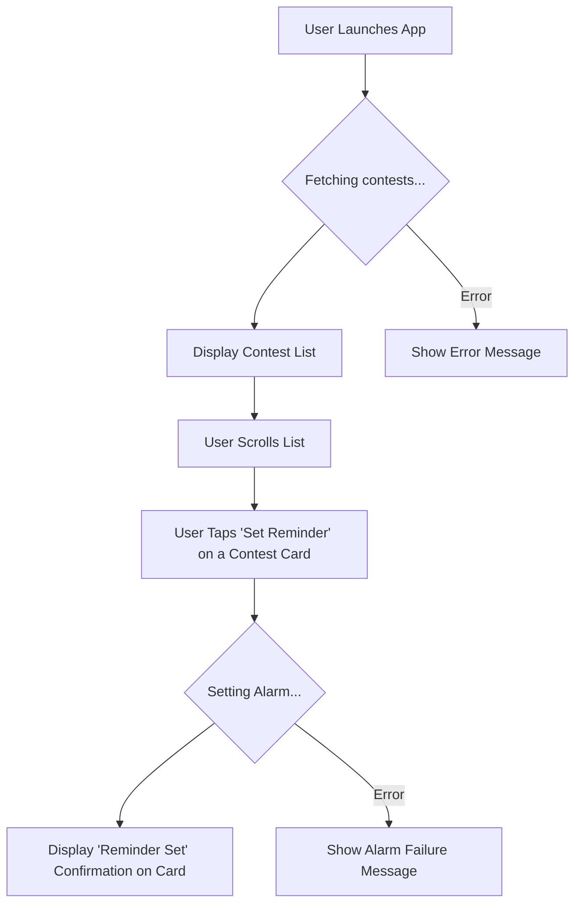
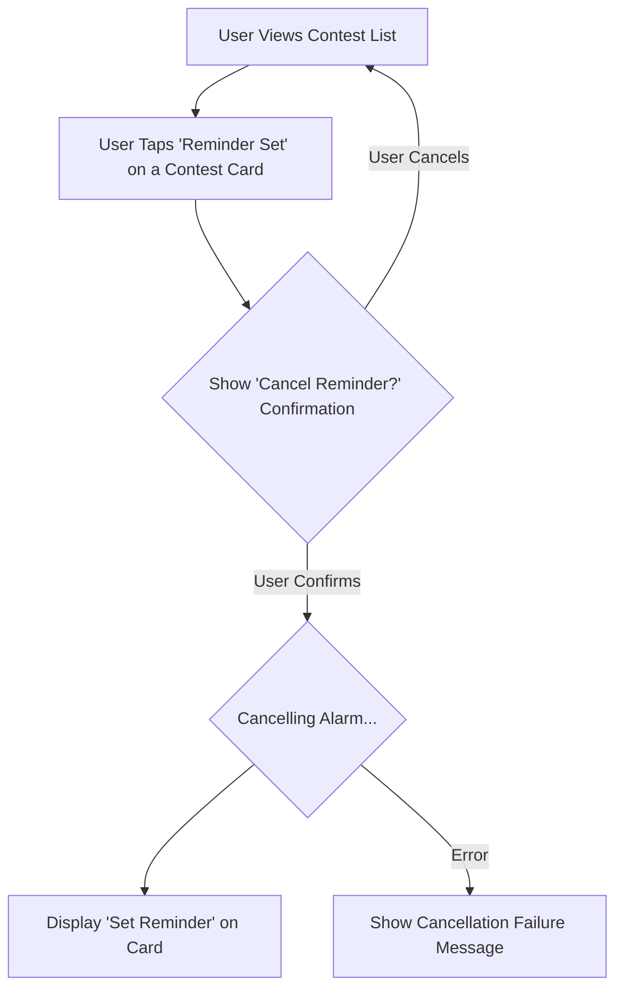

# ContestReminder UI/UX Specification

This document defines the user experience goals, information architecture, user flows, and visual design specifications for ContestReminder's user interface. It serves as the foundation for visual design and frontend development, ensuring a cohesive and user-centered experience.

## Overall UX Goals & Principles

### Target User Personas

- **The Aspiring Competitor (Student):** Highly motivated to improve their competitive programming skills for career advancement or academic achievement. They are often busy with coursework and need a simple, fire-and-forget tool to ensure they don't miss valuable contest opportunities. They value reliability and ease of use over a feature-rich application.

- **The Seasoned Professional (Developer):** A software engineer who participates in coding contests to keep their skills sharp, for enjoyment, or to prepare for technical interviews. They are tech-savvy, have little patience for inefficient or cluttered apps, and demand tools that are efficient and serve a clear purpose.

### Usability Goals

- **Ease of Learning:** A new user must be able to understand the app's full functionality and set their first reminder within 30 seconds of launching the app.
- **Efficiency of Use:** Setting a reminder for a contest must be achievable with a single tap from the main contest list.
- **Reliability:** The user must feel 100% confident that a set reminder will trigger as a full, system-level alarm, even if the app is closed or the device is offline.
- **Clarity:** The UI must provide instant confirmation when a reminder is set and clearly display the most critical contest information (platform, name, time) without ambiguity.

### Design Principles

1.  **Simplicity First:** The app must do one thing and do it perfectly. Every UI element must directly serve the core user goal: setting a reliable contest reminder.
2.  **Clarity and Focus:** The interface will be clean and uncluttered. We will prioritize essential information and remove all potential distractions.
3.  **Reliability as a Feature:** The design itself must communicate trustworthiness. This will be reflected in clear feedback, unambiguous states, and a stable, predictable interface.
4.  **Frictionless Interaction:** The path from seeing a contest to setting a reminder will be as short as humanly possible.

## Information Architecture (IA)

### Site Map / Screen Inventory

### Navigation Structure

- **Primary Navigation:** None. The application is a single-screen experience. The primary content (the contest list) is immediately available on launch.
- **Secondary Navigation:** None.
- **Breadcrumb Strategy:** Not applicable. There is no hierarchical navigation to track.

## User Flows

### Flow: Set Contest Reminder

**User Goal:** To successfully schedule a system-level alarm for a specific contest.

**Entry Points:** App Launch.

**Success Criteria:** The user receives clear confirmation that the alarm has been set, and the UI updates to reflect this state.

**Flow Diagram:**

**Edge Cases & Error Handling:**
- Network error occurs while fetching the contest list.
- The API returns no upcoming contests to display.
- The app lacks the necessary permissions to schedule a system-level alarm.

**Notes:** This flow represents the single most critical interaction in the application.

### Flow: Cancel Contest Reminder

**User Goal:** To cancel a previously scheduled alarm for a specific contest.

**Entry Points:** Viewing the contest list where a reminder has already been set.

**Success Criteria:** The user receives confirmation that the alarm is canceled, and the UI reverts to the 'Set Reminder' state.

**Flow Diagram:**

**Edge Cases & Error Handling:**
- The system alarm fails to cancel due to a service error.
- The user cancels the cancellation action.

**Notes:** This flow is essential for giving users control and preventing unwanted alarms.

## Wireframes & Mockups

**Primary Design Files:** The primary source of truth for visual designs and prototypes will be maintained in Figma. [Link to Figma Project - TBD]

### Key Screen Layouts

#### Screen: Contest List Screen

**Purpose:** To display a clear, scannable list of upcoming coding contests and allow users to set reminders with a single tap.

**Key Elements:**
- **App Bar:** Displays the application title, "Contest Reminder".
- **Contest Card:** A distinct card for each contest containing:
  - Contest Name (e.g., "Weekly Contest 395")
  - Contest Platform (e.g., "LeetCode")
  - Live Countdown Timer (e.g., "Starts in: 1d 4h 32m 10s")
  - Reminder Button (e.g., an alarm icon button).
- **Status Indicators:** Visual feedback for loading states, network errors, and when a reminder is successfully set.

**Interaction Notes:** The list supports smooth vertical scrolling. Tapping the reminder button provides immediate visual feedback, changing the button's state (e.g., icon fills in, color changes). Tapping a set reminder prompts for cancellation.

**Design File Reference:** [Link to specific Figma frame for this screen - TBD]

## Component Library / Design System

**Design System Approach:** To ensure a high-quality, consistent, and efficient development process, this project will adopt **Google's Material Design** system (specifically, Material 3). This provides a robust library of pre-built components, clear design guidelines, and excellent support within modern cross-platform frameworks. The system will be customized with a specific color palette and typography to match the app's brand identity.

### Core Components

#### Component: Top App Bar

**Purpose:** To display the application's title.

**Variants:** Small, centered-title App Bar.

**States:** Default.

**Usage Guidelines:** Remains fixed at the top of the screen, providing a consistent branding and navigation anchor.

#### Component: Contest Card

**Purpose:** To act as a container for all information related to a single upcoming contest.

**Variants:** A single, contained card style will be used.

**States:** Default.

**Usage Guidelines:** Cards are the primary information element and will be displayed in a vertical list with standard spacing between them.

#### Component: Icon Button

**Purpose:** To serve as the primary interactive element for setting and canceling reminders.

**Variants:** A single icon-only button.

**States:** 
- **Default/Unset:** The icon indicates that a reminder can be set (e.g., an outline of an alarm bell).
- **Set:** The icon indicates a reminder is active (e.g., a filled alarm bell icon with an accent color).

**Usage Guidelines:** The button will be placed on each contest card, ensuring it has a sufficiently large touch target.

## Branding & Style Guide

### Visual Identity

**Brand Guidelines:** No formal brand guidelines currently exist. This section will serve as the initial style guide for the MVP.

### Color Palette

| Color Type | Hex Code  | Usage                                               |
| :--------- | :-------- | :-------------------------------------------------- |
| Primary    | `#1976D2` | App Bar, active states, primary buttons, icon fills |
| Secondary  | `#42A5F5` | Secondary accents and highlights                    |
| Accent     | `#FFC107` | Reserved for high-emphasis, future use              |
| Success    | `#4CAF50` | Positive feedback, confirmations                  |
| Warning    | `#FF9800` | Cautions, important notices                       |
| Error      | `#D32F2F` | Errors, destructive actions                       |
| Neutral    | `#FFFFFF`, `#F5F5F5`, `#212121` | Backgrounds, surfaces, and body text.             |

### Typography

- **Primary Font Family:** Roboto
- **Type Scale:** Default Material 3 type scale will be used for all elements (e.g., Display, Headline, Body, Label) to ensure readability and a clear visual hierarchy.

### Iconography

- **Icon Library:** Material Symbols.
- **Usage Guidelines:** The 'Outlined' style will be used for default states, and the 'Filled' style will be used for active/selected states. All interactive icons must have a minimum touch target of 48x48dp.

### Spacing & Layout

- **Grid System:** A standard 8dp grid will be used for all layout and component spacing.
- **Spacing Scale:** All padding and margins will adhere to the Material Design spacing scale (multiples of 4dp and 8dp).

## Accessibility Requirements

### Compliance Target

**Standard:** WCAG 2.1 Level AA

### Key Requirements

**Visual:**
- **Color Contrast:** All text must have a minimum contrast ratio of 4.5:1 against its background. Large text (18pt+ or 14pt+ bold) must have a minimum ratio of 3:1.
- **Focus Indicators:** All interactive elements must have a clearly visible focus indicator when navigated to via accessibility services.

**Interaction:**
- **Screen Reader Support:** All interactive elements and content must have clear, descriptive labels for screen readers (VoiceOver and TalkBack). The content reading order must be logical.
- **Touch Targets:** All touch targets must be at least 48x48dp to ensure they are easily tappable.

**Content:**
- **Alternative Text:** All non-text content that conveys meaning (such as icons) must have a text alternative that serves an equivalent purpose.
- **Heading Structure:** The application will use a logical heading structure to aid navigation for screen reader users.

### Testing Strategy

Testing will include a combination of automated scans using framework-provided tools, manual testing with VoiceOver on iOS and TalkBack on Android, and verifying color contrast ratios during the design phase.

## Responsiveness Strategy

### Breakpoints

Since this is a mobile-only application, we will focus on a single, fluid layout rather than distinct breakpoints. The design should be tested against the following range.

| Breakpoint      | Min Width | Max Width | Target Devices                    |
| :-------------- | :-------- | :-------- | :-------------------------------- |
| Standard Mobile | ~320dp    | ~500dp    | All supported iOS & Android phones |

### Adaptation Patterns

- **Layout Changes:** The layout will be fluid. The primary contest list will be a single column, and cards will expand to fill the available screen width (minus standard horizontal margins).
- **Navigation Changes:** Not applicable, as navigation is static for the MVP.
- **Content Priority:** Text within cards will wrap as needed. All content on the card is considered high priority and will be visible on all screen sizes.
- **Interaction Changes:** Touch target sizes (minimum 48dp) will be maintained across all devices and screen densities.

## Animation & Micro-interactions

### Motion Principles

Animations will be subtle, functional, and purposeful. They should enhance clarity, provide immediate feedback, and contribute to a sense of responsiveness and reliability. Avoid gratuitous or distracting animations.

### Key Animations

- **Reminder Button State Change:** A subtle visual transition when the reminder button is tapped, indicating the state change from "unset" to "set" (e.g., icon fill, color change). (Duration: Short (e.g., 150ms), Easing: Standard Material Design easing (e.g., `fastOutSlowIn`))
- **Contest Card Loading State:** A subtle shimmer or skeleton loading animation for contest cards while data is being fetched, providing visual feedback that content is on its way. (Duration: Continuous loop, Easing: Linear)
- **List Scrolling:** Smooth, performant scrolling of the contest list. (Duration: N/A (user-driven), Easing: Standard Material Design scroll physics)

## Performance Considerations

### Performance Goals

- **App Launch & Initial Display:** The application should launch and display the initial contest list in under 2 seconds.
- **Interaction Response:** All user interactions (e.g., tapping the reminder button) should have immediate visual feedback, with responses under 100ms.
- **Animation & Scrolling:** Animations and list scrolling should maintain a consistent 60 frames per second (FPS) on target devices.

### Design Strategies

Prioritize efficient rendering of the contest list. Minimize complex visual effects that could impact performance. Implement skeleton loading states to manage perceived performance and provide immediate feedback to the user while data is being fetched.

## Next Steps

### Immediate Actions

1.  Review this UI/UX Specification with key stakeholders (Product Owner, Scrum Master, Development Lead) for alignment and feedback.
2.  Initiate high-fidelity visual design and prototyping in Figma based on this specification.
3.  Prepare for handoff to the Design Architect for frontend technical architecture planning.

### Design Handoff Checklist

-   All user flows documented
-   Component inventory complete
-   Accessibility requirements defined
-   Responsive strategy clear
-   Brand guidelines incorporated
-   Performance goals established

## Checklist Results

(Results from running a UI/UX checklist against this document would be placed here.)
